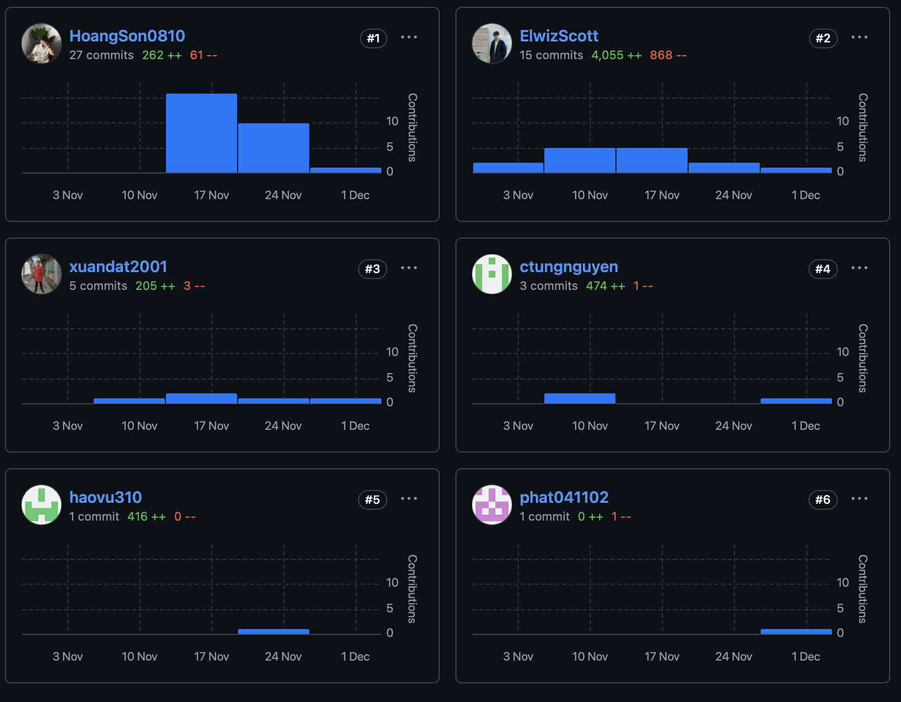

# GH-10 – Team Contribution Log (GitHub Insights Setup)

## 🎯 Goal  
Collect evidence of GitHub contribution activity for Milestone 1 (R03).  
Includes screenshots + contribution summary table.

---

## 📸 GitHub Insights Screenshots (Evidence)

Insert screenshots into:
/docs/report/assets/github-insights/

Screenshots to include:

- contributions-overview.png  
- member-HoangSon0810.png  
- member-ElwizScott.png  
- member-xuandat2001.png  
- member-ctungnguyen.png  
- member-haovu310.png  
- member-phat041102.png  

Example embedding:

### Team Contributions Overview  

### Individual Contributions  
#### HoangSon0810  

#### ElwizScott  

#### xuandat2001  

#### ctungnguyen  

#### haovu310  

#### phat041102  

---

## 📊 Contribution Summary Table

| Member | Commits | Additions | Deletions | Issues | Reviews | Notes |
|--------|---------|-----------|-----------|--------|---------|--------|
| **HoangSon0810** | 27 | 262++ | 61-- | 2 | 1 | Highest total commits |
| **ElwizScott** | 15 | 4,055++ | 868-- | 4 | 3 | Largest code contributor |
| **xuandat2001** | 5 | 205++ | 3-- | 1 | 0 | UI + frontend tasks |
| **ctungnguyen** | 3 | 474++ | 1-- | 0 | 1 | Backend design |
| **haovu310** | 1 | 416++ | 0-- | 0 | 0 | Documentation + research |
| **phat041102** | 1 | 0++ | 1-- | 0 | 0 | Diagram contributions |

---

## 🧾 Requirement Coverage (SRS R03)

This section satisfies:

- **Proof of GitHub usage** (Milestone 1 requirement R03)  
- Avoids **3-point penalty** for missing contribution evidence  
- Matches SRS instruction to include commits/issues/reviews per member

---

## 🗂 Folder Structure (Recommended)

/docs/report/
contribution-summary.md
/assets/github-insights/
contributions-overview.png
member-HoangSon0810.png
member-ElwizScott.png
member-xuandat2001.png
member-ctungnguyen.png
member-haovu310.png
member-phat041102.png

---

## ✔ Ready for Appendix Submission  
Copy this file into `/docs/report/contribution-summary.md` and push to GitHub.

